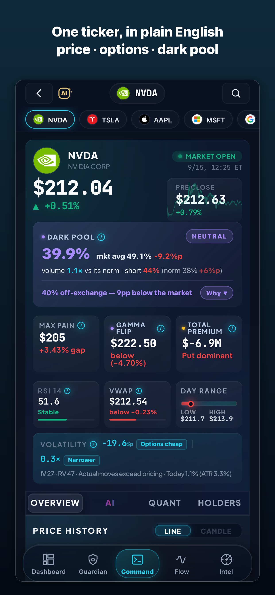

# US Options Market Structure — Daily Snapshots

Daily snapshots of **options market structure** for large-cap US stocks and ETFs — the same numbers shown in the free **SIGNUM HQ** app:

- **Max pain** — the strike where total option-holder value is minimized at expiration
- **Net GEX** — net dealer gamma exposure (sign shows whether dealers are net long or short gamma)
- **Gamma flip** — the spot level where net GEX changes sign
- **Call wall / put floor** — strikes with the largest call / put open interest

Files land in this repo as `YYYY-MM-DD.json` (one object per ticker, plus field definitions). Coverage today: SPY, QQQ, AAPL, NVDA, TSLA, MSFT, AMZN, META, AMD, GOOGL, NFLX, AVGO.

  

## Where the numbers come from

Every value is a **derived metric** computed by the SIGNUM HQ app from the current listed options chain (open interest and greeks). No quotes or raw chain data are redistributed here — only the structure levels. The app shows the same levels live, with the expiration selector, dark-pool share and AI briefings that don't fit in a JSON file.

- **iOS / Android:** https://www.signumhq.com/app?from=github
- **Web:** https://www.signumhq.com

## How people use this

Traders and researchers use structure levels to *describe* where positioning is concentrated — for example, how far spot sits from max pain into a weekly expiration, or whether net GEX is positive (dealers hedge against moves) or negative (dealers hedge with moves). These are descriptions of current positioning, not forecasts.

## Notes & license

- Snapshots are taken after the US close; the `expiration` field states which expiration the levels refer to.
- Data (JSON) is released under **CC BY 4.0** — cite “SIGNUM HQ (signumhq.com)”. The screenshot is © SIGNUM HQ, LLC.
- Nothing here is investment advice. Past positioning does not determine future prices.
